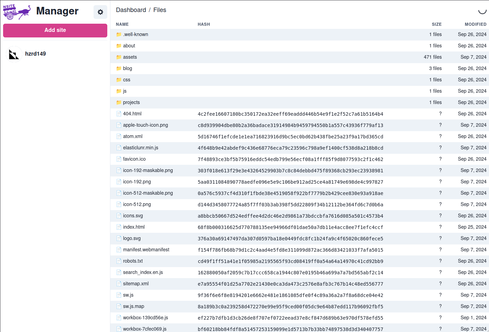

# nsite-manager

A management dashboard for your nsites built using [rx-nostr](https://penpenpng.github.io/rx-nostr/) and [applesauce](https://hzrd149.github.io/applesauce/)



## Prerequisites

    Node.js (version 20 or higher)
    pnpm (version 9 or higher)

## Getting Started

First, clone the repository:

```bash
git clone https://github.com/hzrd149/nsite-manager
cd nsite-manager
```

Install the dependencies:

```bash
pnpm install
```

## Available Scripts

You can run the following commands with pnpm:

Development server:

```bash
pnpm dev
```

This starts the development server at http://localhost:5173

Build for production:

```bash
pnpm build
```

This creates a dist folder with the production build

Preview production build:

```bash
pnpm preview
```

This lets you preview the production build locally
